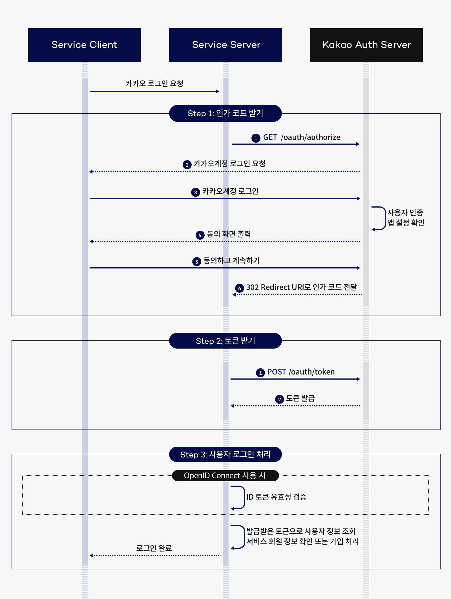

# 🚀 2단계 - 주문하기
## 기능 요구 사항
- 카카오톡 메시지 API를 사용하여 주문하기 기능을 구현한다.

- 주문할 때 수령인에게 보낼 메시지를 작성할 수 있다.
- 상품 옵션과 해당 수량을 선택하여 주문하면 해당 상품 옵션의 수량이 차감된다.
- 해당 상품이 위시 리스트에 있는 경우 위시 리스트에서 삭제한다.
- 나에게 보내기를 읽고 주문 내역을 카카오톡 메시지로 전송한다.
- 메시지는 메시지 템플릿의 기본 템플릿이나 사용자 정의 템플릿을 사용하여 자유롭게 작성한다.
- 아래 예시와 같이 HTTP 메시지를 주고받도록 구현한다.

## Request
    POST /api/orders HTTP/1.1
    Authorization: Bearer {token}
    Content-Type: application/json

    {   
        "optionId": 1,
        "quantity": 2,
        "message": "Please handle this order with care."
    }

## Response

    HTTP/1.1 201 Created
    Content-Type: application/json

    {
        "id": 1,
        "optionId": 1,
        "quantity": 2,
        "orderDateTime": "2024-07-21T10:00:00",
        "message": "Please handle this order with care."
    }

# 🚀 1단계 - 카카오 로그인
## 기능 요구 사항
- 카카오 로그인을 통해 인가 코드를 받고, 인가 코드를 사용해 토큰을 받은 후 향후 카카오 API 사용을 준비한다.

- 카카오계정 로그인을 통해 인증 코드를 받는다.
- 토큰 받기를 읽고 액세스 토큰을 추출한다.
- 앱 키, 인가 코드가 절대 유출되지 않도록 한다.
- 특히 시크릿 키는 GitHub나 클라이언트 코드 등 외부에서 볼 수 있는 곳에 추가하지 않는다.
- (선택) 인가 코드를 받는 방법이 불편한 경우 카카오 로그인 화면을 구현한다.
### 실제 카카오 로그인은 아래 그림과 같이 진행된다.

- 하지만 지금과 같이 클라이언트가 없는 상황에서는 아래와 같은 방법으로 인가 코드를 획득한다.

- 내 애플리케이션 > 앱 설정 > 앱 키로 이동하여 REST API 키를 복사한다.
- https://kauth.kakao.com/oauth/authorize?scope=talk_message&response_type=code&redirect_uri=http://localhost:8080&client_id={REST_API_KEY}에 접속하여 카카오톡 메시지 전송에 동의한다.
- http://localhost:8080/?code={AUTHORIZATION_CODE}에서 인가 코드를 추출한다.

# 🚀 0단계 - 기본 코드 준비
## 과제 진행 요구 사항
- 미션은 주문하기 저장소를 포크하고 클론하는 것으로 시작한다.
- 온라인 코드 리뷰 요청 1단계 문서를 참고하여 실습 환경을 구축한다.
- 미션 시작 버튼을 클릭하여 미션을 시작한다.
- 저장소에 GitHub 사용자 이름으로 브랜치가 생성되었는지 확인한다.
- 저장소를 내 계정으로 포크한다.
- 기능을 구현하기 전 README.md에 구현할 기능 목록을 정리해 추가한다.
- Git의 커밋 단위는 앞 단계에서 README.md에 정리한 기능 목록 단위로 추가한다.
- AngularJS Git Commit Message Conventions을 참고해 커밋 메시지를 작성한다.
